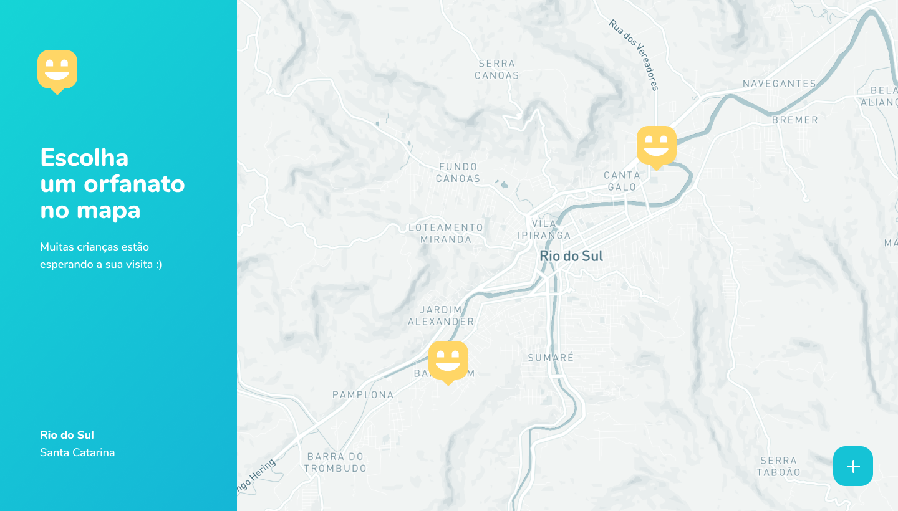
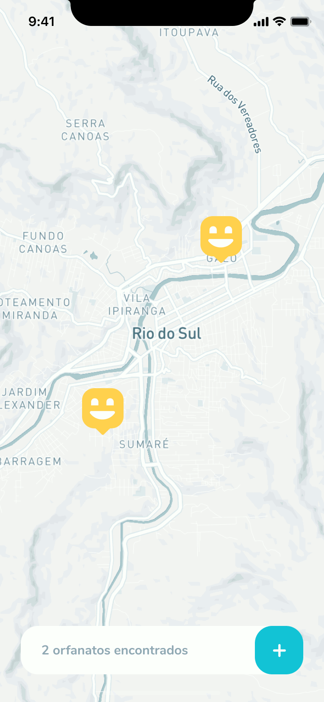

<h1 align="center">Happy</h1>

(en-US)
 <h3> This project includes Back-end, Front-end and also Mobile.</h3>

(pt-BR)
 <h3> Esse projeto englobal Back-end, Front-end e também Mobile.</h3>

 

  

  
  
  

## 🌠 Project/Projeto
(en-US)
Happy is an application that connects people to institutional care homes to make many children's day happier. 💙

(pt-BR)
O Happy é uma aplicação que conecta pessoas à casas de acolhimento institucional para fazer o dia de muitas crianças mais feliz. 💙

## 🎆 Techs/Tecnologias
(en-US)
This project was developed in Rocketseat's NLW3 with the following technologies:

(pt-BR)
Esse projeto foi desenvolvido na NLW3 da Rocketseat com as seguintes tecnologias:

- [Node.js](https://nodejs.org/en/)
- [React](https://reactjs.org)
- [React Native](https://facebook.github.io/react-native/)
- [Expo](https://expo.io/)
- [TypeScript](https://www.typescriptlang.org/)

## 🗒 Licença
(en-US)
This project is under the MIT license. See the [LICENSE] file (LICENSE.md) for more details.

(pt-BR)
Esse projeto está sob a licença MIT. Veja o arquivo [LICENSE](LICENSE.md) para mais detalhes.

---
###### Developed on Next Level Week 3 from [Rocketseat](https://rocketseat.com.br) - by João Vitor Cheron
###### Desenvolvido na Next Level Week 3 da [Rocketseat](https://rocketseat.com.br) - por João Vitor Cheron

